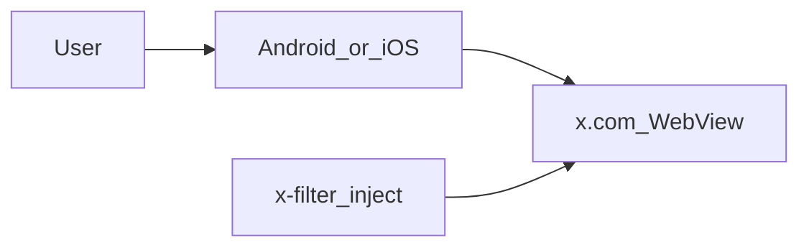

# Architecture

Robin is a native **Android** and **iOS** client that loads **x.com** in a WebView and injects shared filters so the timeline stays ad-light and defaults to Following (For You is optional in Settings). There is no Robin server, Firebase project, or Firestore sync — X sign-in is the WebView cookie session.

## Goals

- Default to the **Following** / reverse-chronological timeline; Settings can switch to algorithmic **For You**.
- Hide promoted posts and other chrome that distracts from people you chose to follow.
- Keep optional analytics / crash reporting off by default for forks (empty config ⇒ disabled).

## High-level flow

## Components

| Piece | Role |
|-------|------|
| [`android/`](../android/) | Jetpack Compose (minSdk 33): `XWebFeedScreen` WebView + `assets/x-filter` inject. Settings for text size, filter toggles, and X sign-out (cookie clear). Optional Sentry via gitignored `sentry.dsn` / `SENTRY_DSN`. Optional Aptabase via `aptabase.appKey` + `aptabase.host` (empty ⇒ off). See [`docs/webview-filter.md`](webview-filter.md) |
| [`ios/`](../ios/) | SwiftUI (iOS 18+): `XWebFeedView` WKWebView + `Resources/x-filter` inject (parity with Android). Settings for text size, filter toggles, and X sign-out (`WKWebsiteDataStore`). Optional Sentry / Aptabase via gitignored `Config.xcconfig`. See [`docs/webview-filter.md`](webview-filter.md) |
| [`fastlane/`](../fastlane/) | Homebrew Fastlane: `android beta` (Play internal testing), `ios beta` (TestFlight), `beta_both`. Secrets stay in env / local paths — not in git |
| [`scripts/feed-credibility/`](../scripts/feed-credibility/) and [`web/feed-compare/`](../web/feed-compare/) | Local comparison of For You vs Following. A Chrome session reads both timelines (the public X API only has reverse-chronological Following). Posts are scored with the Simplifier credibility prompt. `node web/feed-compare/server.cjs` serves the UI on `127.0.0.1`. Not part of the shipped apps |
| [`scripts/benchmark-filter.cjs`](../scripts/benchmark-filter.cjs) | On-device filter benchmark. The in-app controls are debug-only. See [`docs/performance-benchmark.md`](performance-benchmark.md) |

### Android native (Jetpack Compose)

- `XWebFeedScreen` — `x.com` WebView with injected `assets/x-filter` (force Following or For You from Settings, hide promoted / page header; boot cover via `RobinBoot.ready()`). Top bar stays visible; a back-to-top control appears near the top after scrolling. **Near-top auto-refresh:** on return to foreground, title tap while near top, and a foreground poll once the user has been idle ~20s — warm cache-bypassing load of `/home` under a snapshot of the old feed that crossfades away on boot-ready (cooldown from Settings Auto-refresh; default 5 min, Off disables auto). “Show N posts” is auto-clicked by filter-core when X paints it. Settings: text size (default 100% / max 200%), home feed (Following by time or For You), show or hide compose and live content, cookie sign-out, and a link to the source repository. Google/Apple SSO uses an in-app popup WebView (`onCreateWindow`) with `window.opener` for GIS. Non-X web links open in Chrome Custom Tabs.
- See [webview-filter.md](webview-filter.md) and [mobile.md](mobile.md).

### iOS native (SwiftUI)

- `XWebFeedView` — `x.com` WKWebView with injected `Resources/x-filter` (force Following or For You from Settings, hide promoted / page header; Minimal Twitter MIT). A native boot cover hides the WebView until filter-core settles and posts `mtBoot`. Native chrome stays visible; a back-to-top control appears near the top after scrolling. **Near-top auto-refresh:** on return to foreground, title tap while near top, and a poll while foregrounded near the top once the user has been idle ~20s — warm cache-bypassing load of `/home` under a snapshot of the old feed that crossfades away on boot-ready (cooldown from Settings Auto-refresh; default 5 min, Off disables auto). On Mac (`isiOSAppOnMac`), the poll also continues while `.inactive` (visible non-key window). “Show N posts” is auto-clicked by filter-core when X paints it. Settings gear: text size (`FontScaleStore` → `html` `-webkit-text-size-adjust`, default 100% / max 200%), home feed (Following by time or For You), show or hide compose and live content, X sign-out via `WKWebsiteDataStore`, and a link to the source repository. Google/Apple SSO uses an in-app child `WKWebView` so `window.opener` works. Non-X web links open in `SFSafariViewController`.
- See [webview-filter.md](webview-filter.md) and [mobile.md](mobile.md).

## Configuration

| Setting | Where |
|---------|--------|
| Android SDK path | `android/local.properties` (`sdk.dir`) — gitignored |
| Android Sentry DSN | `android/local.properties` (`sentry.dsn`) or env `SENTRY_DSN` — never commit live values |
| Android Aptabase | `android/local.properties` (`aptabase.appKey`, `aptabase.host`) or env — empty ⇒ off |
| iOS Sentry / Aptabase | `ios/Config.xcconfig` — never commit live values |
| Play upload keystore | `android/keystore.properties` — gitignored |

## Out of scope

- Hosted SPA / Firebase Auth / Firestore timeline sync
- Robin-operated X API polling or RSS
- Shared / multi-member backend feeds
- Streaming / Account Activity APIs
