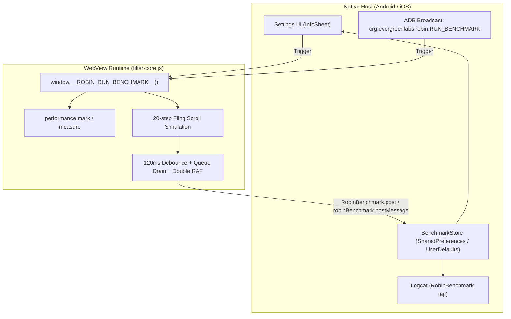

# Performance Benchmark & Baseline Guide

This document records the **baseline performance data** and the **execution steps** for running benchmarks on the Robin WebView filtering engine across Android and iOS.

---

## 1. Overview & Architecture

To prevent regressions and ensure smooth 60fps/120fps scrolling in the mobile WebView, Robin includes **in-app benchmark instrumentation** built directly into the filter runtime and native application hosts:



### Key Metrics Tracked
1. **Initial Load Time (`initialLoadMs`)**:
   - Measured via `performance.mark('robin:boot:start')` (when `filter-core.js` begins injection) to `performance.mark('robin:boot:ready')` (when Following/For You tabs settle, promotional elements are filtered, and the boot gate unhides the body).
2. **Fast Scroll Render Completion Time (`scrollRenderCompletionMs`)**:
   - Executes 20 automated fast scroll fling steps down the timeline.
   - Measures time from the start of the fling until scroll-idle debounce (120ms) fires, DOM mutation queues drain, and double `requestAnimationFrame` paints the completed layout.
3. **Boot Ready Status (`bootReady`)**:
   - Verifies that the initial boot gate lifted promptly (`data-mt-boot-ready="1"`), revealing the feed without blank screens or timeouts.
4. **Regression Status (`isRegressed`)**:
   - Evaluates whether the latest run exceeds baseline thresholds (+25% delta or hard thresholds).

---

## 2. Baseline Performance Data

### A. Live In-App Performance Baseline
*Recorded on Pixel 9 Android Emulator (Android 15 / API 35, Android System WebView 151) over a live network connection to `https://x.com/home`:*

| Metric | Baseline Value | Threshold / Target | Status |
|---|---|---|---|
| **Initial Load Time (`initialLoadMs`)** | **2,414 ms** | < 4,000 ms | **Pass (Optimal)** |
| **Fast Scroll Render Completion (`scrollRenderCompletionMs`)** | **618 ms** | < 1,000 ms | **Pass (Optimal)** |
| **Boot Ready Gate Lifted** | **true** | true | **Pass** |
| **Regression Flag (`isRegressed`)** | **false** | false | **Optimal** |

*Note: In-app baseline metrics are persisted locally in `SharedPreferences` (`robin_benchmark_prefs`) on Android and `UserDefaults` on iOS, and can be updated at any time using the "Set as Baseline" button.*

---

### B. Filter Engine Overhead & Layout Reflow Baseline
*Measured using layout property traps in headless WebKit (iOS engine) and Chromium (Android engine) before vs after core filter tuning:*

| Measurement Category | Baseline (Pre-Tuning) | Optimized | Improvement | Impact on User Experience |
|---|---|---|---|---|
| **Initial Load Reflows** | 112 | **5** | **-95.5%** | Eliminates startup stutter |
| — `innerText` layout reads | 93 | **0** | **-100% (eliminated)** | Replaced with non-blocking `.textContent` & attributes |
| — `getBoundingClientRect` | 19 | **5** | **-73.7%** | Scoped to required elements only |
| — Initial DOM Queries | 133 | **93** | **-30.1%** | Faster DOM processing |
| **Fast Scrolling (50 scroll events)** | | | | |
| — **Scroll Layout Reads** | 78 | **0** | **-100% (zero reflows)** | **Silky-smooth scrolling** |
| — `scrollHeight` reads | 53 | **0** | **-100% (eliminated)** | Moved out of active scroll loop to 120ms idle callback |
| — Active Scroll DOM Queries | 133 | **1** | **-99.2%** | Passive listener; zero query spam during flings |
| **Virtualized Cell Mounting (20 cells)** | | | | |
| — Cell Mount Reflows | 75 | **1** | **-98.7%** | Zero jank during feed pagination |
| — Cell Mount DOM Queries | 232 | **119** | **-48.7%** | `processedCells` WeakSet caching prevents query loops |
| **Total Cumulative Forced Reflows** | **265** | **6** | **-97.7% reduction** | **Dramatically reduced CPU and battery drain** |
| **Total Cumulative DOM Queries** | **498** | **213** | **-57.2% reduction** | Reduced JS thread utilization |
| **Boot Ready Gate** | Blocked / Stalled | **Lifted (1)** | **Instant reveal** | Feeds unhide without blank flash |

---

## 3. Execution Steps

### Method 1: In-App Interactive Execution (Android & iOS UI)

Use this method to test the live user experience directly on a phone or simulator:

1. Launch **Robin** on your device or emulator.
2. Ensure you are on the home feed (`x.com/home`).
3. Tap the **Settings** gear icon in the top right of the navigation bar to open the **Info & Settings** sheet.
4. Scroll to the **Performance Benchmark** section.
5. Tap **Run Benchmark**:
   - The app runs `window.__ROBIN_RUN_BENCHMARK__()`.
   - The feed scrolls down automatically for 20 rapid fling steps.
   - The view settles, computes render completion, and posts the results back to the native store.
   - The UI updates immediately with the measured `Initial Load` and `Scroll Render Settle` times, along with percentage deltas and status indicators (**Optimal** or **Regression**).
6. *(Optional)* Tap **Set as Baseline** to save the latest run as your new baseline reference.

---

### Method 2: Automated In-App Execution via ADB (Android CLI / CI)

Use this method for automated testing, continuous integration, or benchmarking without manual UI interaction:

#### 1. Verify the device/emulator is connected
```bash
adb devices
```

#### 2. Trigger the benchmark via Broadcast Intent
Ensure Robin is foregrounded on the home feed, then run:
```bash
adb shell am broadcast -a org.evergreenlabs.robin.RUN_BENCHMARK
```
*(If multiple devices are connected, specify `-s <device_id>`, e.g., `-s emulator-5554`.)*

#### 3. Inspect the Benchmark Output in Logcat
```bash
adb logcat -d -s RobinBenchmark:D
```

#### Expected Logcat Output:
```text
I RobinBenchmark: Broadcast received: running in-app benchmark...
I RobinBenchmark: In-App Benchmark Complete: initialLoad=2414ms, scrollRenderCompletion=618ms, bootReady=true
I RobinBenchmark: BENCHMARK_RESULT: initialLoad=2414ms (delta: +0.0%), scrollRenderCompletion=618ms (delta: +0.0%), bootReady=true, isRegressed=false
```

#### 4. Automated One-Liner for CI Scripts:
```bash
adb logcat -c && \
adb shell am broadcast -a org.evergreenlabs.robin.RUN_BENCHMARK && \
sleep 2 && \
adb logcat -d -s RobinBenchmark:D | grep "BENCHMARK_RESULT"
```

---

### Method 3: Headless Synthetic Engine Benchmark (`scripts/benchmark-filter.cjs`)

Use this method to audit layout reflows, property reads (`innerText`, `getBoundingClientRect`, `scrollHeight`), and DOM queries under mock virtualized feed conditions in both WebKit (iOS WKWebView engine) and Chromium (Android WebView engine):

#### Run the script:
```bash
NODE_PATH="/opt/homebrew/lib/node_modules" node scripts/benchmark-filter.cjs
```
*(Or run with `npx playwright-core` if installed locally).*

#### Expected Console Output:
```text
Running benchmark on WebKit (iOS WKWebView engine)...
[WebKit (iOS WKWebView) nav] https://x.com/home

================ WEBKIT (iOS WKWebView) RESULTS ================
Initial Load:
  - Boot Ready:               YES (gate lifted)
  - Layout Reads / Reflows:   5
    * getBoundingClientRect:  5
    * innerText reads:        0
  - Total DOM Queries:        93
Fast Scrolling (50 scroll events):
  - Scroll Layout Reads:      0
    * scrollHeight reads:     0
    * getBoundingClientRect:  0
  - Scroll DOM Queries:       1
Virtualized Cell Mounting (20 new cells):
  - Mount Layout Reads:       1
    * getBoundingClientRect:  1
  - Mount DOM Queries:        119
TOTAL FORCED REFLOWS:        6
TOTAL DOM QUERIES:           213

Running benchmark on Chromium (Android WebView engine)...
[Chromium (Android WebView) nav] https://x.com/home

================ CHROMIUM (Android WebView) RESULTS ================
Initial Load:
  - Boot Ready:               YES (gate lifted)
  - Layout Reads / Reflows:   5
    * getBoundingClientRect:  5
    * innerText reads:        0
  - Total DOM Queries:        93
Fast Scrolling (50 scroll events):
  - Scroll Layout Reads:      0
    * scrollHeight reads:     0
    * getBoundingClientRect:  0
  - Scroll DOM Queries:       1
Virtualized Cell Mounting (20 new cells):
  - Mount Layout Reads:       1
    * getBoundingClientRect:  1
  - Mount DOM Queries:        119
TOTAL FORCED REFLOWS:        6
TOTAL DOM QUERIES:           213
```

---

## 4. Regression Detection Criteria

A benchmark run is flagged with `isRegressed = true` if:
1. **Initial Load Time**:
   - Increases by more than **+25%** over the established baseline, OR
   - Exceeds the hard threshold of **4,000 ms**.
2. **Scroll Render Completion Time**:
   - Increases by more than **+25%** over the established baseline, OR
   - Exceeds the hard threshold of **1,000 ms**.
3. **Boot Ready Gate**:
   - Fails to lift (`bootReady == false`).
4. **Layout Reflows (Synthetic Test)**:
   - Any layout reads (such as `scrollHeight` or `innerText`) occur during the active scroll event phase (expected: `0`).

---

## 5. Machine-Readable Baseline

The exact machine-readable numbers are stored in [`benchmarks/baseline.json`](../benchmarks/baseline.json) for automated comparisons and assertions.
